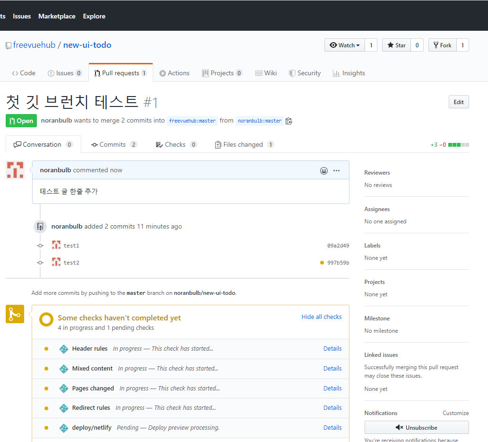

## git law
-

#### 이미 받아진 폴더에서 깃 연결 이 안될때 로그인
```` sh
git config --global user.email "you@example.com"
git config --global user.name "Your Name"

````

#### 폴더별로 깃 연결 ( --global 삭제 )
```` sh
git config user.email "you@example.com"
git config user.name "Your Name"

````

#### 업데이트 방법
```` sh
git add .
git commit -m "first commit"
git push origin master (일반 푸시)
git push --force origin master (강제 푸시)
````

#### 서버에서 로컬로 복사
```` sh
git clone https://github.com/noranbulb/jxslider.git ( 폴더 그대로 복사 )
git pull upstream master (상대방 파일 받아오기)
git pull origin master (내 파일 받아오기)

````

#### 리모트 관리 ( clone 후에 필수 연결해야함 )
```` sh
git remote add upstream https://github.com/freevuehub/new-ui-todo.git // 상대방 리모트 추가
git remote // 리모트 목록
git remote remove uptest  // 리모트 삭제
````

#### 상대방 깃 가져오고 형상관리
```` sh

fork 를 먼저 하고
git clone https://github.com/noranbulb/new-ui-todo.git ( 폴더 그대로 복사 )
git remote add upstream https://github.com/freevuehub/new-ui-todo.git // 상대방 리모트 추가
git pull upstream master // 파일 받아오고

git push 내 깃 허브에 업데이트

````





#### 브런치 생성 방법
```` sh
git branch dev (dev 브런치 생성 )
git checkout dev (dev 브런치 선택 )

git push --force origin dev
````


#### 원격 브런치 리스트 보기와 삭제 방법
```` sh
git remote show origin ( 브런치 목록 보기 )
git push origin :브런지 이름 ( 브런치 삭제 )

````


#### commit 삭제 방법
```` sh
git reset --hard HEAD~3
````
```` sh
git reset --hard HEAD^^^
````


#### top title

```` sh
  project name
  -------    (ex: -가 한개여도 상관없다 )
````

#### sub title

```` sh
  #### sub title
  -------
````

#### html expression

```` sh
  ```` html    내용작성      ````
````


#### javascript xpression

```` sh
  ```` javascript    내용작성      ````
````


#### table expression

```` sh
  Option | Type | Default | Description
  ------ | ---- | ------- | -----------
````


  td 1 | td 2 | td 3 | td 3
  -- | -- | -- | --
--- | 2 | 3 | 4

